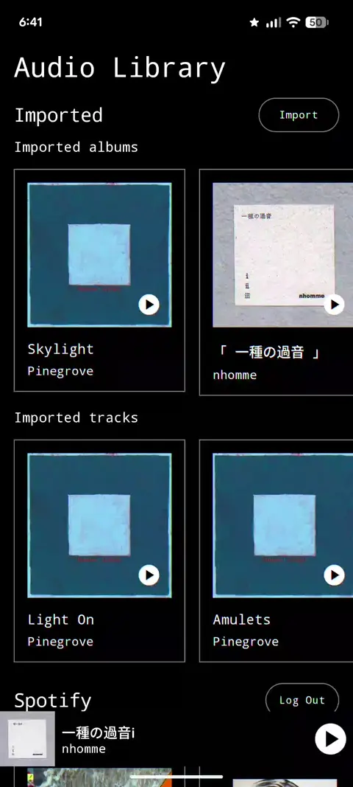

MediaPlayground is an Android project to experiment with media APIs, patterns, and tools. 
It uses the theme, components, and utilities from [UiPlayground](https://github.com/alexrdclement/UiPlayground). 

